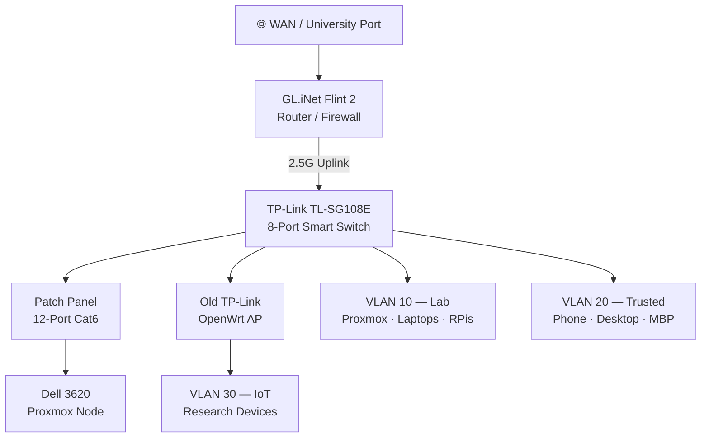

# 🏠 Homelab Documentation

> Personal homelab documentation — currently deployed in a PhD lab environment, moving home soon.

## Quick Links

| Section | Description |
|---|---|
| [Physical Infrastructure](docs/physical/README.md) | Rack layout, hardware inventory, power |
| [Networking](docs/networking/README.md) | Topology, VLANs, firewall, VPN |
| [Services](docs/services/README.md) | Proxmox VMs, NAS, monitoring, self-hosted apps |
| [Devices](docs/devices/README.md) | All connected endpoints |

## High-Level Overview



## Status

| Item | Status |
|---|---|
| Physical rack build | 🔲 Planned |
| VLAN configuration | 🔲 Planned |
| Proxmox setup | ✅ Running |
| NAS / storage | 🔲 In progress (HDDs pending) |
| VPN (inbound) | 🔲 Planned |
| Mullvad on Trusted VLAN | 🔲 Planned |
| Monitoring stack | 🔧 Partial |

## Repo Structure

```
homelab-docs/
├── README.md                   ← You are here
├── docs/
│   ├── physical/
│   │   ├── README.md           ← Rack layout & hardware inventory
│   │   ├── power.md            ← UPS, PDU, power planning
│   │   └── rack-layout.md      ← Visual rack diagram & placement
│   ├── networking/
│   │   ├── README.md           ← Network overview & topology
│   │   ├── vlans.md            ← VLAN design & policy
│   │   ├── firewall.md         ← Firewall rules & design
│   │   └── vpn.md              ← Inbound VPN & Mullvad config
│   ├── services/
│   │   ├── README.md           ← Services overview
│   │   ├── proxmox.md          ← Proxmox setup & VMs
│   │   ├── nas.md              ← NAS / storage / qBittorrent
│   │   └── monitoring.md       ← Monitoring stack
│   └── devices/
│       └── README.md           ← Device inventory & notes
└── assets/                     ← Diagrams, screenshots
```
