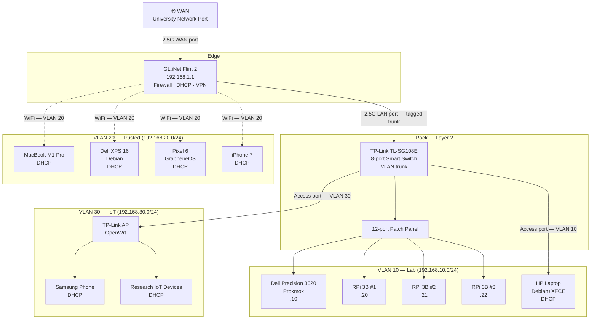

# Networking

## Contents

- [VLANs](vlans.md) — design, IP scheme, inter-VLAN policy
- [Firewall](firewall.md) — rules and segmentation strategy
- [VPN](vpn.md) — inbound remote access + Mullvad on Trusted VLAN

## Hardware

| Device | Role |
|---|---|
| GL.iNet GL-MT6000 Flint 2 | Edge router, DHCP, firewall, WiFi 6 |
| TP-Link TL-SG108E | Layer 2 smart switch (802.1Q VLAN tagging, QoS, IGMP, LAG) |
| TP-Link (OpenWrt) | Isolated wireless AP for IoT VLAN |

## Network Topology

## IP Addressing Scheme

| VLAN | Name | Subnet | Gateway | DHCP Range |
|---|---|---|---|---|
| 1 | Management | 192.168.1.0/24 | 192.168.1.1 | Static only |
| 10 | Lab | 192.168.10.0/24 | 192.168.10.1 | .100–.200 |
| 20 | Trusted | 192.168.20.0/24 | 192.168.20.1 | .100–.200 |
| 30 | IoT | 192.168.30.0/24 | 192.168.30.1 | .100–.200 |

### Static Assignments (Lab VLAN)

| Host | IP | Notes |
|---|---|---|
| Dell Proxmox | 192.168.10.10 | Static / DHCP reservation |
| RPi 3B #1 | 192.168.10.20 | |
| RPi 3B #2 | 192.168.10.21 | |
| RPi 3B #3 | 192.168.10.22 | |

## Switch Port Assignment

| Port | VLAN Mode | VLAN | Device |
|---|---|---|---|
| 1 | Trunk | 1,10,20,30 | Router uplink |
| 2 | Access | 10 | Proxmox |
| 3 | Access | 10 | RPi 1 |
| 4 | Access | 10 | RPi 2 |
| 5 | Access | 10 | RPi 3 |
| 6 | Access | 30 | IoT AP |
| 7 | Access | 10 | HP Laptop |
| 8 | — | — | Reserved |
