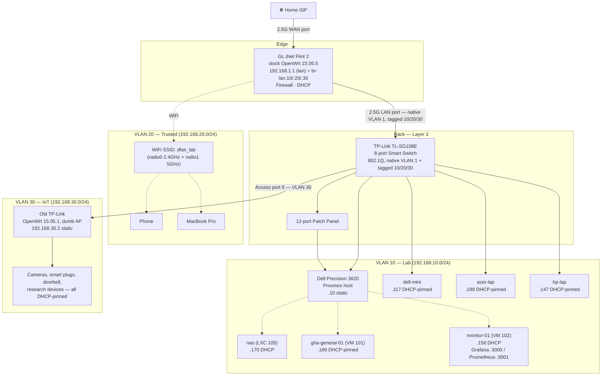

# Networking

## Contents

- [VLANs](vlans.md) — design, IP scheme, inter-VLAN policy
- [Firewall](firewall.md) — rules and segmentation strategy
- [VPN](vpn.md) — inbound remote access + Mullvad on Trusted VLAN

## Hardware

| Device | Role |
|---|---|
| GL.iNet GL-MT6000 Flint 2 | Edge router, DHCP, firewall, WiFi. Stock OpenWrt 23.05.5 (not GL.iNet firmware) |
| TP-Link TL-SG108E | Layer 2 smart switch (802.1Q VLAN tagging, QoS, IGMP, LAG) |
| Old TP-Link (unknown model) | OpenWrt 15.05.1 "Chaos Calmer", dumb AP for IoT VLAN — no routing/DHCP of its own |

## Network Topology

```mermaid
graph TD
    WAN[🌐 Home ISP]

    subgraph Edge
        Router["GL.iNet Flint 2\nstock OpenWrt 23.05.5\n192.168.1.1 (lan) + br-lan.10/.20/.30\nFirewall · DHCP"]
    end

    subgraph "Rack — Layer 2"
        Switch["TP-Link TL-SG108E\n8-port Smart Switch\n802.1Q, native VLAN 1 + tagged 10/20/30"]
        Patch["12-port Patch Panel"]
    end

    subgraph "VLAN 10 — Lab (192.168.10.0/24)"
        PVE["Dell Precision 3620\nProxmox host\n.10 static"]
        NAS["nas (LXC 105)\n.170 DHCP"]
        GHA["gha-general-01 (VM 101)\n.189 DHCP-pinned"]
        MON["monitor-01 (VM 102)\n.158 DHCP\nGrafana :3000 / Prometheus :3001"]
        DELLMINI["dell-mini\n.117 DHCP-pinned"]
        ACERLAP["acer-lap\n.199 DHCP-pinned"]
        DEBIAN["hp-lap\n.147 DHCP-pinned"]
    end

    subgraph "VLAN 20 — Trusted (192.168.20.0/24)"
        SSID["WiFi SSID: dfair_lab\n(radio0 2.4GHz + radio1 5GHz)"]
        PHONE["Phone"]
        MBP["MacBook Pro"]
    end

    subgraph "VLAN 30 — IoT (192.168.30.0/24)"
        IoTAP["Old TP-Link\nOpenWrt 15.05.1, dumb AP\n192.168.30.2 static"]
        IOTDEV["Cameras, smart plugs, doorbell,\nresearch devices — all DHCP-pinned"]
    end

    WAN -->|"2.5G WAN port"| Router
    Router -->|"2.5G LAN port — native VLAN 1, tagged 10/20/30"| Switch
    Switch --> Patch
    Patch --> PVE
    Switch --> PVE
    Switch --> DELLMINI
    Switch --> ACERLAP
    Switch --> DEBIAN
    PVE -.-> NAS
    PVE -.-> GHA
    PVE -.-> MON
    Switch -->|"Access port 6 — VLAN 30"| IoTAP
    IoTAP --> IOTDEV
    Router -.->|"WiFi"| SSID
    SSID -.-> PHONE
    SSID -.-> MBP
```

## IP Addressing Scheme

| VLAN | Name | Subnet | Gateway | DHCP Range |
|---|---|---|---|---|
| 1 | Management | 192.168.1.0/24 | 192.168.1.1 | `.100`–`.249` (DHCP active — not static-only as originally planned; switch mgmt and a few misc devices use it) |
| 10 | Lab | 192.168.10.0/24 | 192.168.10.1 | `.100`–`.200` |
| 20 | Trusted | 192.168.20.0/24 | 192.168.20.1 | `.100`–`.200` |
| 30 | IoT | 192.168.30.0/24 | 192.168.30.1 | `.100`–`.200` |

### Static / Pinned Assignments

Superseded the original RPi-era plan. Full current list, including all IoT
device reservations, lives in [devices/README.md](../devices/README.md) —
kept there rather than duplicated here since it changes more often than the
network design itself.

| Host | IP | Notes |
|---|---|---|
| Proxmox host | 192.168.10.10 | Static (in-guest, `/etc/network/interfaces`) |
| gha-general-01 | 192.168.10.189 | DHCP host reservation |
| dell-mini | 192.168.10.117 | DHCP host reservation |
| acer-lap | 192.168.10.199 | DHCP host reservation |
| hp-lap | 192.168.10.147 | DHCP host reservation |
| Old TP-Link (IoT AP) | 192.168.30.2 | Static (in-guest) |
| 12 IoT devices | 192.168.30.x | DHCP host reservations — see devices/README.md |

## Upstream DNS

The Flint 2 gets its WAN DNS servers by DHCP: `10.127.10.25` and
`10.127.10.26` (search domain `mcghi.mcg.edu`), and dnsmasq forwards every
VLAN's queries to them. Observed 2026-10-08:

- These resolvers are **filtered** (Cisco Umbrella) — blocked domains resolve
  to the `146.112.61.x` block-page range instead of failing (e.g.
  `api.telegram.org`).
- **Outbound DNS to public resolvers is blocked** — `nslookup` against
  `1.1.1.1` / `9.9.9.9` from the router times out.

So any service that needs a blocked domain won't work from the lab, and
pointing dnsmasq at a public resolver isn't an option. Working around the
filtering (DoH, tunneling) would mean bypassing the upstream network's own
controls — check its acceptable-use policy first; the same question applies
to the planned Mullvad setup for VLAN 20 (#12).

## Switch Port Assignment

Read from the switch UI (`VLAN > 802.1Q VLAN` and `VLAN > 802.1Q VLAN PVID
Setting`) on 2026-10-08, post-Phase 3. Port 1 is the only trunk; VLAN 20 has
no wired access ports (Trusted is WiFi-only via `dfair_lab`). Admin UI is on
the mgmt network at `192.168.1.160` — not reachable from `trusted` by default;
use an SSH tunnel through the router (`ssh -L 8080:192.168.1.160:80
root@192.168.1.1`, then `http://localhost:8080`).

| Port | VLAN 1 (mgmt) | VLAN 10 (Lab) | VLAN 20 (Trusted) | VLAN 30 (IoT) | PVID | Device |
|---|---|---|---|---|---|---|
| 1 | Untagged (native) | Tagged | Tagged | Tagged | 1 | GL.iNet Flint 2 uplink (`lan1`) — trunk |
| 2 | Not Member | Untagged | Not Member | Not Member | 10 | Proxmox (Dell Precision 3620) |
| 3 | Not Member | Untagged | Not Member | Not Member | 10 | `dell-mini` (Dell OptiPlex 3050 Micro) |
| 4 | Not Member | Untagged | Not Member | Not Member | 10 | `acer-lap` (Acer Aspire 5) |
| 5 | Not Member | Untagged | Not Member | Not Member | 10 | `hp-lap` (HP EliteBook 840 G2) |
| 6 | Not Member | Not Member | Not Member | Untagged | 30 | Old TP-Link (OpenWrt) — dedicated IoT AP |
| 7 | Untagged | Not Member | Not Member | Not Member | 1 | Empty |
| 8 | Untagged | Not Member | Not Member | Not Member | 1 | Reserved / maintenance |

Port 6 was left as an untagged member of VLAN 1 after Phase 3 (ingress was
fine via PVID 30, but VLAN 1 broadcasts flooded out onto the IoT segment).
Removed 2026-10-08; IoT AP (`192.168.30.2`) and IoT clients verified
reachable afterwards.

> TL-SG108E gotcha: VLAN membership (tagged/untagged/not member) and PVID are
> **two separate pages** (`VLAN > 802.1Q VLAN` and `VLAN > 802.1Q VLAN PVID
> Setting`) — easy to configure one and forget the other, leaving a port
> half-configured.
>
> **Lesson learned (caused a real outage during Phase 2):** originally tagged
> `lan1` for VLAN 1 on the router before the switch had any 802.1Q config —
> this cut off everything through the switch (proxmox, the switch's own mgmt
> UI at 192.168.1.160) since the router started sending/expecting tagged
> frames on a link the switch was still treating as flat. Full loss of
> reachability to the switch's management page, confirmed via `ping` timing
> out even from the router itself — not a browser/cache issue.
>
> **Fix, and the pattern going forward:** use **native VLAN 1** on the trunk —
> VLAN 1 stays **untagged** on `lan1` (`lan1:u*`), matching the switch's
> untouched factory-default state exactly, so it needs **zero changes** to
> keep working. Only the *new* VLAN (30) is tagged on the trunk. This means
> adding a VLAN never risks breaking existing traffic — the router and switch
> only need to agree on the newly-added tagged VLAN, not renegotiate the
> already-working native one. Apply this same pattern in Phase 3 for VLANs 10
> and 20.
