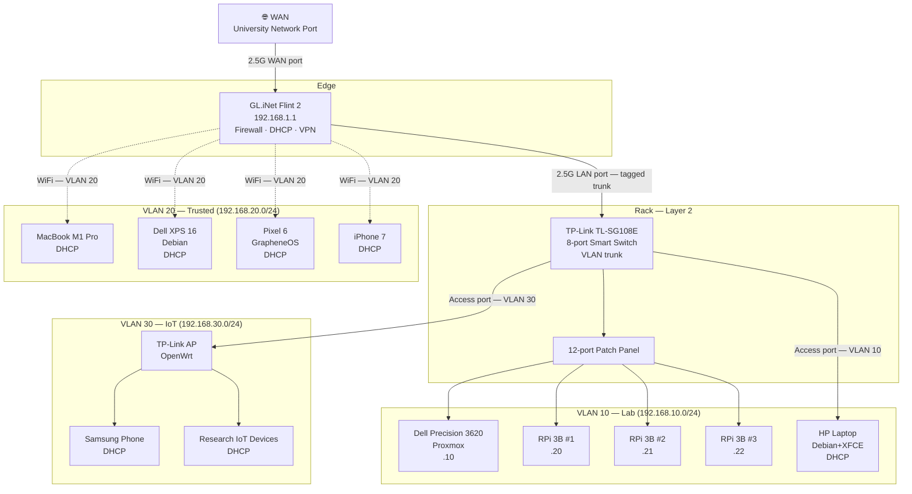

# Networking

## Contents

- [VLANs](vlans.md) — design, IP scheme, inter-VLAN policy
- [Firewall](firewall.md) — rules and segmentation strategy
- [VPN](vpn.md) — inbound remote access + Mullvad on Trusted VLAN

## Hardware

| Device | Role |
|---|---|
| GL.iNet GL-MT6000 Flint 2 | Edge router, DHCP, firewall, WiFi 6 |
| TP-Link TL-SG108E | Layer 2 smart switch (802.1Q VLAN tagging, QoS, IGMP, LAG) |
| TP-Link (OpenWrt) | Isolated wireless AP for IoT VLAN |

## Network Topology

```mermaid
graph TD
    WAN[🌐 WAN\nUniversity Network Port]

    subgraph Edge
        Router["GL.iNet Flint 2\n192.168.1.1\nFirewall · DHCP · VPN"]
    end

    subgraph "Rack — Layer 2"
        Switch["TP-Link TL-SG108E\n8-port Smart Switch\nVLAN trunk"]
        Patch["12-port Patch Panel"]
    end

    subgraph "VLAN 10 — Lab (192.168.10.0/24)"
        PVE["Dell Precision 3620\nProxmox\n.10"]
        RPI1["RPi 3B #1\n.20"]
        RPI2["RPi 3B #2\n.21"]
        RPI3["RPi 3B #3\n.22"]
        HPLAP["HP Laptop\nDebian+XFCE\nDHCP"]
    end

    subgraph "VLAN 20 — Trusted (192.168.20.0/24)"
        MBP["MacBook M1 Pro\nDHCP"]
        XPS["Dell XPS 16\nDebian\nDHCP"]
        PX6["Pixel 6\nGrapheneOS\nDHCP"]
        IP7["iPhone 7\nDHCP"]
    end

    subgraph "VLAN 30 — IoT (192.168.30.0/24)"
        IoTAP["TP-Link AP\nOpenWrt"]
        SAM["Samsung Phone\nDHCP"]
        IOTDEV["Research IoT Devices\nDHCP"]
    end

    WAN -->|"2.5G WAN port"| Router
    Router -->|"2.5G LAN port — tagged trunk"| Switch
    Switch --> Patch
    Patch --> PVE
    Patch --> RPI1
    Patch --> RPI2
    Patch --> RPI3
    Switch -->|"Access port — VLAN 10"| HPLAP
    Switch -->|"Access port — VLAN 30"| IoTAP
    IoTAP --> SAM
    IoTAP --> IOTDEV
    Router -.->|"WiFi — VLAN 20"| MBP
    Router -.->|"WiFi — VLAN 20"| XPS
    Router -.->|"WiFi — VLAN 20"| PX6
    Router -.->|"WiFi — VLAN 20"| IP7
```

## IP Addressing Scheme

| VLAN | Name | Subnet | Gateway | DHCP Range |
|---|---|---|---|---|
| 1 | Management | 192.168.1.0/24 | 192.168.1.1 | Static only |
| 10 | Lab | 192.168.10.0/24 | 192.168.10.1 | .100–.200 |
| 20 | Trusted | 192.168.20.0/24 | 192.168.20.1 | .100–.200 |
| 30 | IoT | 192.168.30.0/24 | 192.168.30.1 | .100–.200 |

### Static Assignments (Lab VLAN)

| Host | IP | Notes |
|---|---|---|
| Dell Proxmox | 192.168.10.10 | Static / DHCP reservation |
| RPi 3B #1 | 192.168.10.20 | |
| RPi 3B #2 | 192.168.10.21 | |
| RPi 3B #3 | 192.168.10.22 | |

## Switch Port Assignment

Updated to match actual current hardware (post-move) and the phased rollout —
see [vlans.md](vlans.md) for phase status. Only ports 1 and 6 required changes
from switch factory default; 2-5, 7-8 are untouched (Untagged VLAN 1, PVID 1).

| Port | VLAN Mode | VLAN 1 | VLAN 30 | PVID | Device |
|---|---|---|---|---|---|
| 1 | Trunk | Tagged | Tagged | 1 | GL.iNet Flint 2 uplink (`lan1`) |
| 2 | Access | Untagged | Not Member | 1 | Proxmox (Dell Precision 3620) — moves to VLAN 10 in Phase 3 |
| 3 | Access | Untagged | Not Member | 1 | Dell Micro (debian) — moves to VLAN 10 in Phase 3 |
| 4 | Access | Untagged | Not Member | 1 | Acer Aspire (debian) — moves to VLAN 10 in Phase 3 |
| 5 | Access | Untagged | Not Member | 1 | HP Laptop (debian) — moves to VLAN 10 in Phase 3 |
| 6 | Access | Not Member | Untagged | 30 | Old TP-Link (OpenWrt) — dedicated IoT AP |
| 7 | — | Untagged | Not Member | 1 | Empty |
| 8 | — | Untagged | Not Member | 1 | Reserved / maintenance |

> TL-SG108E gotcha: VLAN membership (tagged/untagged/not member) and PVID are
> **two separate pages** (`VLAN > 802.1Q VLAN` and `VLAN > 802.1Q VLAN PVID
> Setting`) — easy to configure one and forget the other, leaving a port
> half-configured.
>
> Tagging the router's `lan1` for VLAN 1 (instead of leaving it untagged)
> before the switch's 802.1Q config is applied causes a transient outage for
> everything reachable only through the switch (e.g. Proxmox) — the router
> sends/expects tagged frames on that port while the switch is still flat.
> Expected during the rollout window between the router-side and switch-side
> changes; resolves once switch port 1 is set to Tagged for VLAN 1 to match.
