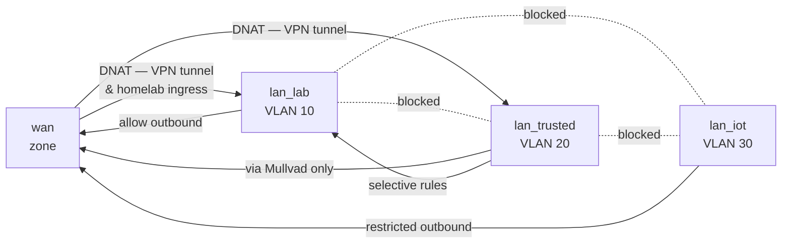

# Firewall

The GL.iNet Flint 2 runs OpenWrt, giving full nftables/iptables access alongside the LuCI GUI. Firewall rules are applied at the router level between VLAN interfaces.

## Zone Model



## Default Zone Policies

| Zone | INPUT | OUTPUT | FORWARD |
|---|---|---|---|
| wan | DROP | ACCEPT | DROP |
| lan_lab | ACCEPT | ACCEPT | ACCEPT |
| lan_trusted | ACCEPT | ACCEPT | ACCEPT |
| lan_iot | DROP | ACCEPT | DROP |

## Planned Firewall Rules

### WAN → Router (INPUT)
| # | Protocol | Port | Action | Notes |
|---|---|---|---|---|
| 1 | UDP | 51820 | ACCEPT | WireGuard inbound (homelab VPN) |
| 2 | TCP | 22 | DROP | No SSH from WAN — use VPN |
| — | * | * | DROP | Default deny |

### Trusted VLAN → Internet
All traffic from VLAN 20 is policy-routed to the Mullvad WireGuard interface. A kill switch rule drops traffic if the VPN interface is down:

```
# Conceptual nftables kill switch
chain forward {
    iifname "br-trusted" oifname != "mullvad0" drop
}
```

### IoT VLAN — Restricted Outbound
Allow only what research devices need; deny everything else by default.

| Protocol | Destination | Action | Notes |
|---|---|---|---|
| UDP/TCP | 53 | ACCEPT | DNS (router only) |
| TCP | 80, 443 | ACCEPT | HTTP/HTTPS if needed |
| * | RFC1918 | DROP | No lateral movement |
| * | * | DROP | Default deny |

### Selective Trusted → Lab Access
Add rules as needed. Starting point — only Proxmox UI:

| Protocol | Destination | Port | Action |
|---|---|---|---|
| TCP | 192.168.10.10 | 8006 | ACCEPT (Proxmox web UI) |
| TCP | 192.168.10.10 | 22 | ACCEPT (SSH to Proxmox) |
| * | 192.168.10.0/24 | * | DROP |

## TODO

- [ ] Implement zone config in OpenWrt UCI / LuCI
- [ ] Configure Mullvad WireGuard interface + kill switch
- [ ] Test VLAN isolation with `nmap` cross-VLAN scans
- [ ] Set up firewall logging for dropped packets (helps with debugging IoT devices)
- [ ] Consider running a dedicated firewall VM on Proxmox (e.g. pfSense/OPNsense) in the future for more granular control
