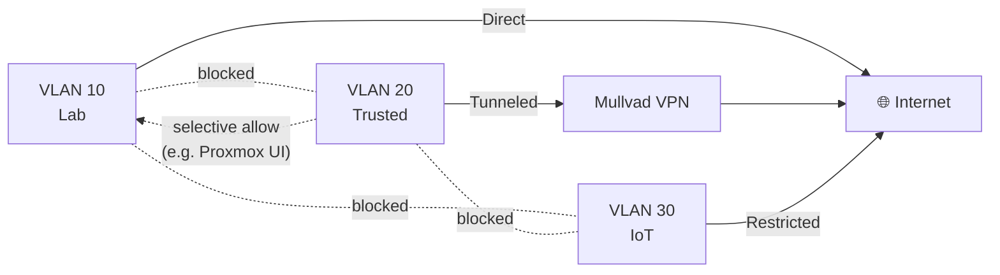

# VLANs

## Design Philosophy

Three VLANs segment traffic by trust level and use case. IoT devices get the strictest isolation since they run unknown/research firmware. Trusted devices get full internet access through Mullvad VPN. Lab devices can communicate freely within the VLAN and have controlled outbound access.

## VLAN Definitions

### VLAN 10 — Lab

**Purpose:** Infrastructure and compute devices that stay in (or near) the lab.

| Property | Value |
|---|---|
| Subnet | 192.168.10.0/24 |
| Gateway | 192.168.10.1 |
| DNS | 192.168.10.1 (router) |
| Internet | Direct (no VPN) |
| Inter-VLAN | → Trusted: blocked. → IoT: blocked. |

**Devices:** Proxmox node, Raspberry Pis, HP laptop (Debian/XFCE), Acer Aspire (when present)

---

### VLAN 20 — Trusted

**Purpose:** Personal devices — phones, laptops, daily drivers.

| Property | Value |
|---|---|
| Subnet | 192.168.20.0/24 |
| Gateway | 192.168.20.1 |
| DNS | 192.168.20.1 (router) |
| Internet | **Routed through Mullvad VPN** |
| Inter-VLAN | → Lab: blocked by default (allow specific services as needed). → IoT: blocked. |

**Devices:** MacBook M1 Pro, Dell XPS 16, Pixel 6, iPhone 7

> All outbound traffic from VLAN 20 exits via Mullvad. If the VPN tunnel drops, implement a **kill switch** so traffic doesn't fall back to plain internet.

---

### VLAN 30 — IoT

**Purpose:** Research IoT devices with untrusted/experimental firmware.

| Property | Value |
|---|---|
| Subnet | 192.168.30.0/24 |
| Gateway | 192.168.30.1 |
| DNS | 192.168.30.1 (router) or dedicated resolver |
| Internet | Restricted (allow only what's needed) |
| Inter-VLAN | Fully isolated — no access to Lab or Trusted. |

**Devices:** Research IoT hardware, Samsung phone (for IoT testing), TP-Link OpenWrt AP

> IoT devices connect wirelessly to the OpenWrt AP on a dedicated SSID. This AP uplinks to the switch on a VLAN 30 access port.

---

## Inter-VLAN Traffic Policy

| Source | Destination | Policy |
|---|---|---|
| Lab | Trusted | ❌ Blocked |
| Lab | IoT | ❌ Blocked |
| Trusted | Lab | ⚠️ Selective (e.g. allow :8006 for Proxmox) |
| Trusted | IoT | ❌ Blocked |
| IoT | Lab | ❌ Blocked |
| IoT | Trusted | ❌ Blocked |
| Any | Internet | See per-VLAN policy above |

## TODO / Implementation Notes

- [ ] Configure 802.1Q VLAN tagging on TL-SG108E
- [ ] Create VLAN interfaces on GL.iNet Flint 2 (runs OpenWrt — use LuCI or UCI)
- [ ] Create separate SSIDs per VLAN on Flint 2 WiFi
- [ ] Configure DHCP server per VLAN on router
- [ ] Set up Mullvad WireGuard interface on router, policy-route VLAN 20 traffic through it
- [ ] Configure kill switch (nftables/iptables) for Mullvad on VLAN 20
- [ ] Set up OpenWrt IoT AP with VLAN 30 SSID, trunk to switch
