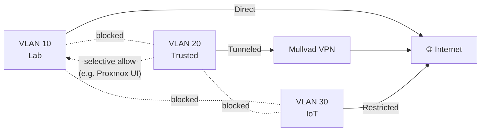

# VLANs

## Design Philosophy

Three VLANs segment traffic by trust level and use case. IoT devices get the strictest isolation since they run unknown/research firmware. Trusted devices get full internet access through Mullvad VPN. Lab devices can communicate freely within the VLAN and have controlled outbound access.

## VLAN Definitions

### VLAN 10 — Lab

**Purpose:** Infrastructure and compute devices that stay in (or near) the lab.

| Property | Value |
|---|---|
| Subnet | 192.168.10.0/24 |
| Gateway | 192.168.10.1 |
| DNS | 192.168.10.1 (router) |
| Internet | Direct (no VPN) |
| Inter-VLAN | → Trusted: blocked. → IoT: blocked. |

**Devices:** Proxmox node, Raspberry Pis, HP laptop (Debian/XFCE), Acer Aspire (when present)

---

### VLAN 20 — Trusted

**Purpose:** Personal devices — phones, laptops, daily drivers.

| Property | Value |
|---|---|
| Subnet | 192.168.20.0/24 |
| Gateway | 192.168.20.1 |
| DNS | 192.168.20.1 (router) |
| Internet | **Routed through Mullvad VPN** |
| Inter-VLAN | → Lab: blocked by default (allow specific services as needed). → IoT: blocked. |

**Devices:** MacBook M1 Pro, Dell XPS 16, Pixel 6, iPhone 7

> All outbound traffic from VLAN 20 exits via Mullvad. If the VPN tunnel drops, implement a **kill switch** so traffic doesn't fall back to plain internet.

---

### VLAN 30 — IoT

**Purpose:** Research IoT devices with untrusted/experimental firmware.

| Property | Value |
|---|---|
| Subnet | 192.168.30.0/24 |
| Gateway | 192.168.30.1 |
| DNS | 192.168.30.1 (router) or dedicated resolver |
| Internet | Restricted (allow only what's needed) |
| Inter-VLAN | Fully isolated — no access to Lab or Trusted. |

**Devices:** Research IoT hardware, Samsung phone (for IoT testing), TP-Link OpenWrt AP

> IoT devices connect wirelessly to the OpenWrt AP on a dedicated SSID. This AP uplinks to the switch on a VLAN 30 access port.

---

## Inter-VLAN Traffic Policy

```mermaid
flowchart LR
    L10[VLAN 10\nLab]
    L20[VLAN 20\nTrusted]
    L30[VLAN 30\nIoT]
    WAN[🌐 Internet]
    VPN[Mullvad VPN]

    L10 -->|Direct| WAN
    L20 -->|Tunneled| VPN --> WAN
    L30 -->|Restricted| WAN

    L10 -. blocked .- L20
    L10 -. blocked .- L30
    L20 -. blocked .- L30
    L20 -.->|"selective allow\n(e.g. Proxmox UI)"| L10
```

| Source | Destination | Policy |
|---|---|---|
| Lab | Trusted | ❌ Blocked |
| Lab | IoT | ❌ Blocked |
| Trusted | Lab | ⚠️ Selective (e.g. allow :8006 for Proxmox) |
| Trusted | IoT | ❌ Blocked |
| IoT | Lab | ❌ Blocked |
| IoT | Trusted | ❌ Blocked |
| Any | Internet | See per-VLAN policy above |

## Rollout Plan (Phased)

Earlier attempt at doing all VLANs in one pass on the Flint 2 failed at the
switch/router VLAN tagging step. Flint 2 runs **stock OpenWrt** (not GL.iNet's
own firmware), which uses DSA + bridge-vlan-filtering rather than classic
swconfig — tagging must be done via `br-lan` VLAN filtering + per-port
tagged/untagged bridge-vlan members, not per-interface `.VLANID` subinterfaces.
Rolling out incrementally to isolate failures to one layer at a time:

- [x] **Phase 1** — Flint 2 as plain main router (flat LAN, no VLANs). Replaces
      TP-Link as the WAN-facing device. Confirms WAN/NAT/DHCP works before any
      switch complexity is introduced.
      Notes: TL-SG108E needed a factory reset (leftover VLAN config from the
      earlier failed attempt was blocking L2 forwarding entirely — 802.1Q mode
      is currently `Disable`). Proxmox is reachable via static `192.168.1.197`
      (falls inside the `.100`–`.249` DHCP pool — flag for exclusion/reservation
      later). Acer/HP/Dell-mini debian boxes skipped for now (no network
      config done on them yet, not blocking).
- [x] **Phase 2a** — VLAN 30 (IoT) interface live on the Flint 2. Enabled
      `vlan_filtering` on `br-lan`, tagged `lan1` (2.5G uplink) for VLAN 1 + 30,
      left `lan2`-`lan5` untagged/PVID in VLAN 1. `br-lan.1` (192.168.1.1) and
      `br-lan.30` (192.168.30.1) both up, SSH survived the reload.
      **Root cause of every prior lockout on this exact router (GL-MT6000):**
      once `vlan_filtering` is enabled, the `lan` interface must bind to the
      VLAN 1 subinterface (`option device 'br-lan.1'`), not the raw bridge
      device (`br-lan`). Binding to the raw bridge while filtering is active
      is what caused the "changes apply, device goes unreachable" failure that
      led to repeated reflashes in the earlier attempt — confirmed as a known
      GL-MT6000-specific gotcha via the OpenWrt forum, not user error.
      (See: forum.openwrt.org/t/vlan-config-problems-on-gl-inet-gl-mt6000/200882
      and forum.openwrt.org/t/gl-inet-flint-2-gl-mt6000-vlan-best-practices-on-openwrt-snapshot/251673)
- [x] **Phase 2b** — DHCP server on `iot` interface (`.100`-`.249`, 12h lease),
      firewall zone (`input`/`forward` DROP by default, explicit allow only for
      DHCP/DNS-to-router and forwarding to `wan`). Switch VLAN 30 added via
      native-VLAN-1 pattern (see above) — zero disruption to existing traffic.
      Switch port 6 is now VLAN 30 untagged/PVID 30, ready for the IoT AP.
      Old TP-Link (15.05.1 "Chaos Calmer", ar71xx — its own switch/VLAN config
      untouched, only became a dumb AP) reconfigured: LAN static
      `192.168.30.2`, own DHCP server disabled (`dhcp.lan.ignore=1`), WAN
      disabled (`proto=none`), wired into switch port 6. Verified end-to-end:
      phone joined its `OpenWrt` SSID, got a `192.168.30.x` lease from the
      Flint 2, has internet access.
      **Phase 2 complete.**
- [x] **Phase 3a** — VLAN 10 (Lab) and VLAN 20 (Trusted) router-side infra
      live: `br-lan.10` (192.168.10.1), `br-lan.20` (192.168.20.1), DHCP
      scopes (`.100`-`.200`), firewall zones (ACCEPT/ACCEPT/ACCEPT, forward
      to `wan` only, no cross-zone rules yet). Hostname set to `flint2` (was
      causing tab mix-ups with the identically-prompted TP-Link). No devices
      migrated yet, no switch access ports assigned — infra only, per the
      decision to stand up VLANs before moving working devices.
- [ ] **Phase 3b** — Switch: add VLAN 10 + 20 to 802.1Q table, tagged port 1
      only (trunk), no access ports yet.
- [ ] **Phase 3c** — Migrate devices one at a time (lowest-risk first, proxmox
      last): switch port → new VLAN untagged/PVID, device static IP → new
      subnet. Per-VLAN SSIDs on Flint 2 WiFi for Trusted. Selective
      Trusted→Lab firewall rule (proxmox :8006/:22) once proxmox is on VLAN 10.
      Mullvad WireGuard + kill switch for VLAN 20 — separate follow-up task.

## TODO / Implementation Notes

- [ ] Configure 802.1Q VLAN tagging on TL-SG108E
- [ ] Create VLAN interfaces on GL.iNet Flint 2 (stock OpenWrt — DSA bridge-vlan-filtering via LuCI or UCI)
- [ ] Create separate SSIDs per VLAN on Flint 2 WiFi
- [ ] Configure DHCP server per VLAN on router
- [ ] Set up Mullvad WireGuard interface on router, policy-route VLAN 20 traffic through it
- [ ] Configure kill switch (nftables/iptables) for Mullvad on VLAN 20
- [ ] Set up OpenWrt IoT AP with VLAN 30 SSID, trunk to switch
