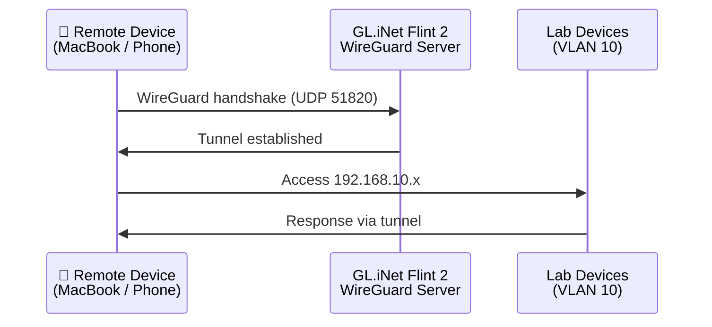
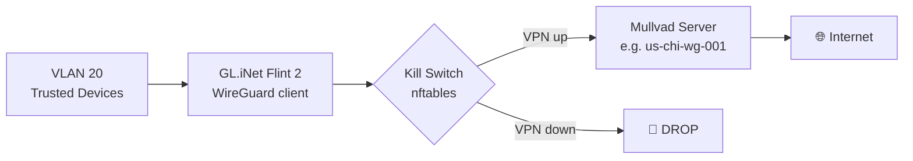

# VPN

Two distinct VPN configurations:

1. **Inbound (Remote Access)** — WireGuard server on the router to VPN *into* the homelab remotely
2. **Outbound (Mullvad)** — WireGuard client on the router, tunneling all Trusted VLAN (VLAN 20) traffic through Mullvad

---

## 1. Inbound VPN — Remote Access to Homelab

**Goal:** Access homelab devices (Proxmox, RPis, etc.) from anywhere — phone, laptop, or any device.

**Approach:** Run a WireGuard server on the GL.iNet Flint 2 (natively supported via LuCI or GL.iNet panel).



### Configuration Sketch

```
# /etc/wireguard/wg0.conf (server side — on router)
[Interface]
Address = 10.100.0.1/24
ListenPort = 51820
PrivateKey = <router_private_key>

# MacBook M1
[Peer]
PublicKey = <mbp_public_key>
AllowedIPs = 10.100.0.2/32

# Pixel 6
[Peer]
PublicKey = <pixel_public_key>
AllowedIPs = 10.100.0.3/32
```

**Client AllowedIPs:** Set to `192.168.10.0/24, 192.168.20.0/24, 10.100.0.0/24` to route only homelab traffic through the tunnel (split tunnel), or `0.0.0.0/0` for full tunnel.

### Requirements
- Port forward UDP 51820 on the WAN interface to the router
- Dynamic DNS if your WAN IP changes (university DHCP likely rotates)
- GL.iNet has a built-in DDNS service (`gl-inet.com` subdomain) — use this or set up your own with a domain

### Client Setup
| Device | WireGuard client |
|---|---|
| MacBook M1 | WireGuard for macOS (App Store) |
| Dell XPS 16 (Debian) | `apt install wireguard` |
| Pixel 6 (GrapheneOS) | WireGuard for Android |
| iPhone 7 | WireGuard for iOS |

---

## 2. Outbound VPN — Mullvad on Trusted VLAN

**Goal:** Route all traffic from VLAN 20 (Trusted) through Mullvad, with a kill switch to prevent leaks.

**Approach:** WireGuard client on GL.iNet Flint 2, policy-based routing to send VLAN 20 traffic through the Mullvad interface.



### Steps (OpenWrt)

1. Download Mullvad WireGuard config from [Mullvad account portal](https://mullvad.net/en/account/wireguard-config)
2. Install config as a WireGuard interface (`mullvad0`) on the router
3. Create a routing table for VLAN 20 traffic
4. Add nftables kill switch rule — drop VLAN 20 forwarding if `mullvad0` is down
5. Test with `curl https://am.i.mullvad.net/connected` from a Trusted device

### Mullvad DNS
Mullvad provides a DNS server at `10.64.0.1` — configure this as the DNS for VLAN 20 to avoid DNS leaks.

---

## TODO

- [ ] Enable WireGuard server on GL.iNet Flint 2
- [ ] Set up GL.iNet DDNS (or custom domain) for stable remote access hostname
- [ ] Generate peer configs for all client devices
- [ ] Set up Mullvad WireGuard client interface
- [ ] Policy-route VLAN 20 → Mullvad
- [ ] Implement kill switch
- [ ] Verify no DNS leaks (`dnsleaktest.com` from Trusted device)
- [ ] Document final WireGuard public keys (no private keys in repo!)
