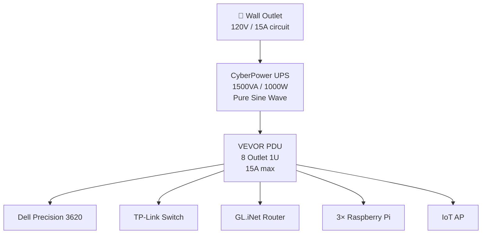

# Power Infrastructure

## Equipment

### UPS — CyberPower CP1500PFCLCD

| Spec | Value |
|---|---|
| Capacity | 1500VA / 1000W |
| Waveform | Pure sine wave (PFC compatible) |
| Outlets | 12 (battery backup + surge) |
| Form factor | Mini tower |
| Features | AVR, LCD display, UL certified |

Pure sine wave output is important for modern ATX PSUs and networking gear with active PFC — this UPS handles that correctly.

### PDU — VEVOR 8-Outlet Rackmount

| Spec | Value |
|---|---|
| Outlets | 8 |
| Form factor | 1U horizontal rackmount |
| Voltage / Current | 110–125V / 15A |
| Cable | 6ft 14AWG |
| Protection | Surge + overload |

The PDU draws from the UPS. Total PDU load must stay under **15A (1800W at 120V)** to avoid the breaker, and under the UPS's **1000W** capacity to remain on battery.

## Power Budget (Estimated)

| Device | Est. Draw | Notes |
|---|---|---|
| Dell Precision 3620 | ~150–200W | Idle ~80W, load ~180W |
| TP-Link TL-SG108E | ~7W | |
| GL.iNet Flint 2 | ~15W | |
| Patch panel | 0W | Passive |
| 3× Raspberry Pi 3B | ~15W total | ~5W each |
| IoT AP (TP-Link) | ~5W | |
| **Total (est.)** | **~190–240W** | Well within 1000W UPS |

> At ~200W load, the 1000W UPS provides roughly **30 minutes** of runtime on battery. Actual runtime depends on battery age and load profile — check CyberPower's runtime curve.

## Power Flow

## Recommendations

- **Monitor UPS load** via the LCD or PowerPanel software. Target staying below 80% capacity (800W).
- **Test battery runtime** annually — CP1500PFCLCD has a self-test function.
- **Label PDU outlets** once devices are connected.
- When moving home, verify the wall circuit is a **dedicated 15A or 20A circuit** to avoid tripping shared breakers.
- Consider adding a **smart PDU** in the future for per-outlet monitoring/switching.
