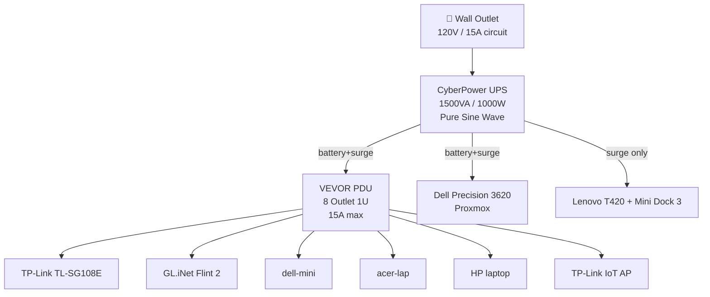

# Power Infrastructure

## Equipment

### UPS — CyberPower CP1500PFCLCD

| Spec | Value |
|---|---|
| Capacity | 1500VA / 1000W |
| Waveform | Pure sine wave (PFC compatible) |
| Outlets | 12 (battery backup + surge) |
| Form factor | Mini tower |
| Features | AVR, LCD display, UL certified |

Pure sine wave output is important for modern ATX PSUs and networking gear with active PFC — this UPS handles that correctly.

### PDU — VEVOR 8-Outlet Rackmount

| Spec | Value |
|---|---|
| Outlets | 8 |
| Form factor | 1U horizontal rackmount |
| Voltage / Current | 110–125V / 15A |
| Cable | 6ft 14AWG |
| Protection | Surge + overload |

The PDU draws from the UPS. Total PDU load must stay under **15A (1800W at 120V)** to avoid the breaker, and under the UPS's **1000W** capacity to remain on battery.

## Power Distribution Plan (confirmed post-move)

The CP1500PFCLCD splits its 12 outlets into a **battery+surge** bank and a
**surge-only** bank — only the former stays up during an outage.

- **UPS battery+surge bank** (direct, not through the PDU):
  - Proxmox (Dell Precision 3620)
  - PDU
- **UPS surge-only bank** (direct, no battery backup — acceptable since
  it's non-critical personal gear, not lab infra):
  - Lenovo ThinkPad T420 + ThinkPad Mini Dock 3
- **PDU** (fed from the UPS battery+surge bank, 8 outlets, 6 used):
  - GL.iNet Flint 2 (router)
  - TP-Link TL-SG108E (switch)
  - `dell-mini`
  - `acer-lap`
  - HP laptop
  - TP-Link IoT AP (the top-of-rack unit — its power runs to the PDU even
    though it physically sits with the T420/minidock, which does not)

## Power Budget (Estimated)

| Device | Est. Draw | Bank | Notes |
|---|---|---|---|
| Dell Precision 3620 | ~150–200W | UPS battery+surge (direct) | Idle ~80W, load ~180W |
| PDU-fed devices (below) | | UPS battery+surge (via PDU) | |
| TP-Link TL-SG108E | ~7W | PDU | |
| GL.iNet Flint 2 | ~15W | PDU | |
| `dell-mini` (OptiPlex 3050 Micro) | ~20W | PDU | Rough estimate, not measured |
| `acer-lap` | ~30W | PDU | Rough estimate, not measured |
| HP laptop | ~30W | PDU | Rough estimate, not measured, not yet networked |
| IoT AP (TP-Link) | ~5W | PDU | |
| Patch panel | 0W | — | Passive |
| Lenovo T420 + Mini Dock 3 | ~30W | UPS surge-only (direct) | Rough estimate; not battery-backed, drops immediately on outage |
| **Total, battery-backed (est.)** | **~257–307W** | | Well within the UPS's 1000W capacity |

> At ~280W battery-backed load, the 1000W UPS provides roughly
> **20–25 minutes** of runtime on battery (down from the earlier ~30min
> estimate now that dell-mini/acer-lap/HP are in the budget). Actual
> runtime depends on battery age and load profile — check CyberPower's
> runtime curve. The T420/minidock aren't included in this runtime
> estimate since they're surge-only and lose power immediately in an
> outage regardless.

## Power Flow

```mermaid
flowchart TD
    WALL[🔌 Wall Outlet\n120V / 15A circuit]
    UPS[CyberPower UPS\n1500VA / 1000W\nPure Sine Wave]
    PDU[VEVOR PDU\n8 Outlet 1U\n15A max]

    Dell[Dell Precision 3620\nProxmox]
    T420[Lenovo T420 + Mini Dock 3]
    Switch[TP-Link TL-SG108E]
    Router[GL.iNet Flint 2]
    DellMini[dell-mini]
    AcerLap[acer-lap]
    HP[HP laptop]
    AP[TP-Link IoT AP]

    WALL --> UPS
    UPS -->|battery+surge| Dell
    UPS -->|battery+surge| PDU
    UPS -->|surge only| T420
    PDU --> Switch
    PDU --> Router
    PDU --> DellMini
    PDU --> AcerLap
    PDU --> HP
    PDU --> AP
```

## Recommendations

- **Monitor UPS load** via the LCD or PowerPanel software. Target staying below 80% capacity (800W).
- **Test battery runtime** annually — CP1500PFCLCD has a self-test function.
- **Label PDU outlets** once devices are connected.
- Consider adding a **smart PDU** in the future for per-outlet monitoring/switching.
