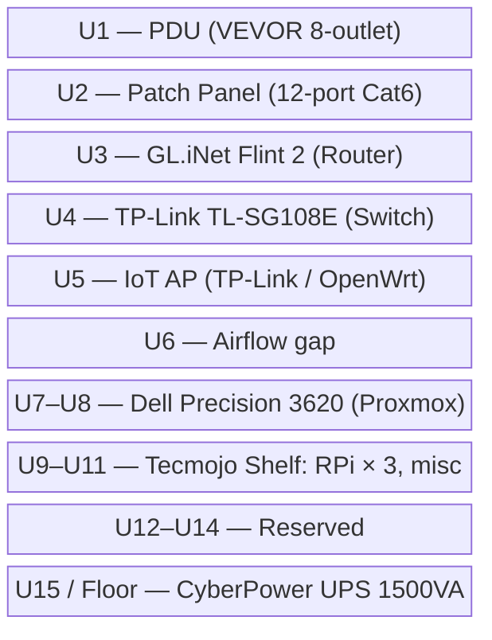

# Rack Layout

**Rack:** Eastrexon 15U Open Frame — 19.7"L × 18.8"W × 32.3"H, wall-mountable with swivel casters.

## Unit Assignment (Planned)

```
┌─────────────────────────────────────┐
│  U1  │ VEVOR 8-Outlet PDU           │
│  U2  │ Cable Matters 12-Port Patch  │
│  U3  │ GL.iNet Flint 2 Router       │
│  U4  │ TP-Link TL-SG108E Switch     │
│  U5  │ [reserved / IoT AP]          │
│  U6  │ ─── 1U gap / airflow ───     │
│  U7  │  
│  U9  │   └─ 3× Raspberry Pi 3B      │
│ U10  │   └─ Old TP-Link AP (IoT)    │
│ U11  │ Tecmojo 1U Vented Shelf      │
│ U12  │  └─ Dell Precision 3620      │
│ U13  │  └─ Dell Precision 3620      │
│ U14  │ [reserved]                   │
│ U15  │ CyberPower UPS (floor/base)  │
└─────────────────────────────────────┘
```

> Note: The Dell 3620 is a tower/SFF unit and will sit on the shelf or be shelf-mounted. Adjust U positions once physical fitment is confirmed.

## Rack Diagram



## Cable Plan (Patch Panel → Switch)

| Patch Port | → Switch Port | Device |
|---|---|---|
| P1 | SW1 | Dell Proxmox (primary) |
| P2 | SW2 | RPi 1 |
| P3 | SW3 | RPi 2 |
| P4 | SW4 | RPi 3 |
| P5 | SW5 | Router uplink (2.5G) |
| P6 | SW6 | IoT AP uplink |
| P7–P12 | SW7–SW8 | Reserved / future |

> Router connects to switch via one of its 2.5G ports. The second 2.5G port on the router connects to the wall network jack.

## Notes

- The Eastrexon is an **open-frame** rack — no side panels. Keep in mind dust and cable management.
- Swivel casters make repositioning easy but ensure they're locked when the rack is in final position.
- The UPS is a **mini tower** form factor; it can sit on the floor beneath the rack or on the bottom shelf area if depth allows.
- When moving home, verify wall-mount anchor points can support the loaded rack weight.
