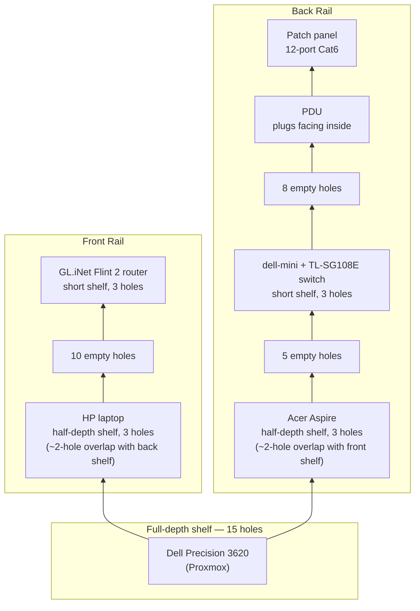

# Rack Layout

**Rack:** Eastrexon 15U Open Frame — 19.7"L × 18.8"W × 32.3"H, wall-mountable
with swivel casters. Open-frame means front and back rails are populated
independently except where a full-depth shelf spans both — this is why the
layout below is two columns instead of one.

## Current Layout (confirmed post-move)

**Below the rack-mount holes:** the CyberPower UPS sits on the rack's own
base tray, above the caster/wheel space — not floor-standing, not
rack-mounted either.

Bottom to top, by bolt-hole count:

```text
                  Dell Precision 3620 (Proxmox)
                  full-depth shelf, 15 holes — shared front+back
        ────────────────────────────────────────────────────────
BACK RAIL                                  FRONT RAIL
Acer Aspire                                HP laptop
half-depth shelf, 3 holes                  half-depth shelf, 3 holes
(overlaps the front shelf's height         (overlaps the back shelf's
 by 2 holes)                                height by 2 holes)
5 empty holes                              10 empty holes
dell-mini + switch (TL-SG108E)             GL.iNet Flint 2 router
short shelf, 3 holes                       short shelf, 3 holes
8 empty holes                              (nothing else on front)
PDU (VEVOR, plugs facing inside)
Patch panel (Cable Matters 12-port), directly above the PDU
```

**On top of the rack frame (not rack-mounted), front side:** Lenovo
ThinkPad Mini Dock 3 + Lenovo ThinkPad T420 + a TP-Link router — this
TP-Link is the same unit documented as `iot-ap` in
[devices/README.md](../devices/README.md) (VLAN 30 dumb AP), not a
separate device.

**Not in the rack at all** (desk equipment, out of scope for this doc): the
3× Raspberry Pi 3B, and the mobile/personal devices and other laptops not
listed above.

## Rack Diagram


```mermaid
flowchart BT
    subgraph Shared["Full-depth shelf — 15 holes"]
        PVE["Dell Precision 3620\n(Proxmox)"]
    end

    subgraph Back["Back Rail"]
        direction BT
        PVE --> ACER["Acer Aspire\nhalf-depth shelf, 3 holes\n(~2-hole overlap with front shelf)"]
        ACER --> BE1["5 empty holes"]
        BE1 --> DM["dell-mini + TL-SG108E switch\nshort shelf, 3 holes"]
        DM --> BE2["8 empty holes"]
        BE2 --> PDU["PDU\nplugs facing inside"]
        PDU --> PATCH["Patch panel\n12-port Cat6"]
    end

    subgraph Front["Front Rail"]
        direction BT
        PVE --> HP["HP laptop\nhalf-depth shelf, 3 holes\n(~2-hole overlap with back shelf)"]
        HP --> FE1["10 empty holes"]
        FE1 --> GL["GL.iNet Flint 2 router\nshort shelf, 3 holes"]
    end
```

## Cable Plan

The patch panel is mounted but **unused** (confirmed 2026-10-08) — every
device patches directly into the TL-SG108E. Port-by-port assignments and
VLAN membership live in the switch port table in
[networking/README.md](../networking/README.md#switch-port-assignment).
Revisit this section if runs are ever moved onto the patch panel.

## Notes

- The Eastrexon is an **open-frame** rack — no side panels, and since front
  and back rails are independent, front/back device counts don't need to
  match (confirmed here: back rail is fuller than front).
- Swivel casters make repositioning easy but ensure they're locked when the
  rack is in its final position.
- The UPS's base-tray placement keeps it clear of the casters without
  taking up rack-mount holes.
