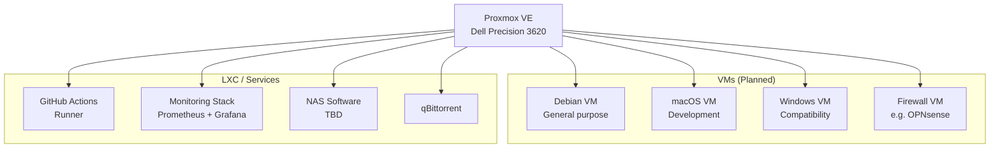

# Services

All services run on or through the **Dell Precision 3620 Proxmox node** unless noted.

## Contents

- [Proxmox](proxmox.md) — hypervisor setup, VMs, GitHub Actions runner
- [NAS & Storage](nas.md) — qBittorrent, NAS software, HDD setup
- [Monitoring](monitoring.md) — current and planned monitoring stack

## Services Overview

## Service Status

| Service | Type | Status | Priority |
|---|---|---|---|
| GitHub Actions runner | LXC/VM | ✅ Running | High |
| Monitoring (Prometheus/Grafana) | LXC/Docker | 🔧 Partial | High |
| qBittorrent | LXC/Docker | 🔲 Planned | Medium |
| NAS software | LXC/VM | 🔲 Planned (HDDs pending) | Medium |
| Firewall VM | VM | 🔲 Planned | Low |
| Debian VM | VM | 🔲 Planned | Low |
| macOS VM | VM | 🔲 Planned | Low |
| Windows VM | VM | 🔲 Planned | Low |
