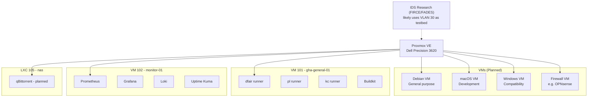

# Services

All services run on or through the **Dell Precision 3620 Proxmox node** unless noted.

## Contents

- [Proxmox](proxmox.md) — hypervisor setup, VMs, GitHub Actions runner
- [NAS & Storage](nas.md) — qBittorrent, NAS software, HDD setup
- [Monitoring](monitoring.md) — current and planned monitoring stack
- [IDS Research](ids-research.md) — dissertation research (FIRCE/FADES),
  likely uses this network's IoT VLAN as its real-world testbed

## Services Overview

```mermaid
graph TD
    PVE[Proxmox VE\nDell Precision 3620]

    subgraph "VMs (Planned)"
        DEBIAN[Debian VM\nGeneral purpose]
        MACOS[macOS VM\nDevelopment]
        WIN[Windows VM\nCompatibility]
        FW[Firewall VM\ne.g. OPNsense]
    end

    subgraph "VM 101 - gha-general-01"
        GHA1[dfair runner]
        GHA2[pl runner]
        GHA3[kc runner]
        BK[Buildkit]
    end

    subgraph "VM 102 - monitor-01"
        PROM[Prometheus]
        GRAF[Grafana]
        LOKI[Loki]
        KUMA[Uptime Kuma]
    end

    subgraph "LXC 105 - nas"
        QB[qBittorrent - planned]
    end

    PVE --> DEBIAN
    PVE --> MACOS
    PVE --> WIN
    PVE --> FW
    PVE --> GHA1
    PVE --> PROM
    PVE --> QB

    IDS["IDS Research (FIRCE/FADES)\nlikely uses VLAN 30 as testbed"]
    IDS -.-> PVE
```

## Service Status

| Service | Type | Status | Priority |
|---|---|---|---|
| GitHub Actions runners (dfair/pl/kc) | 3x Docker containers on `gha-general-01` (VM 101, separate from proxmox itself) | ✅ Running | High |
| Monitoring (Prometheus/Grafana) | Docker, on `monitor-01` (VM 102) | ✅ Running | High |
| qBittorrent | LXC/Docker | 🔲 Planned | Medium |
| NAS software | LXC/VM | 🔲 Planned (HDDs pending) | Medium |
| Firewall VM | VM | 🔲 Planned | Low |
| Debian VM | VM | 🔲 Planned | Low |
| macOS VM | VM | 🔲 Planned | Low |
| Windows VM | VM | 🔲 Planned | Low |
