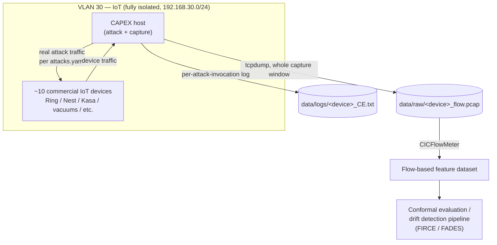
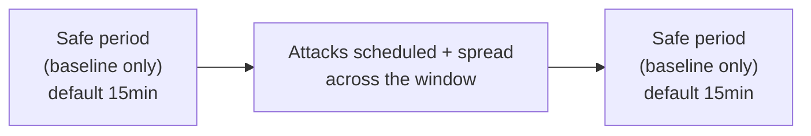

# IDS Research (Dissertation)

This homelab's IoT segment (VLAN 30) doubles as the real-world testbed for
Seth's dissertation research on drift-aware, uncertainty-quantified
intrusion detection. Documented here for reproducibility, per the repo's
[CONTRIBUTING.md](https://github.com/sethbarrett50/home_lab_docs/blob/main/CONTRIBUTING.md)
goal of being useful to anyone trying to reproduce or understand the setup.

## The research line

| Paper | Venue | Year | Summary |
|---|---|---|---|
| [FIRE: Fog-Based Intrusion Detection Framework for Real-Time Security in IoT Environments](https://doi.org/10.1007/978-3-032-07992-3_15) | Lecture Notes in Networks and Systems | 2025 | Earlier fog-based IDS framework for IoT — predecessor context for the FIRCE/FADES line. |
| [FLARE: Feature-Based Lightweight Aggregation for Robust Evaluation of IoT Intrusion Detection](https://doi.org/10.1007/978-3-032-23447-6_23) | LNICST | 2026 | Lightweight feature aggregation for evaluating IoT IDS performance. |
| [FIRCE: A Framework for Intrusion Response and Conformal Evaluation](https://doi.org/10.48550/arxiv.2605.01962) (preprint) / [published version](https://doi.org/10.1109/smartnets69662.2026.11604738) | arXiv preprint, published at IEEE SmartNets 2026 | 2026 | Augments supervised IDS classifiers with **conformal evaluation-based uncertainty quantification and drift detection**. Four conformal evaluation strategies (Inductive, Cross, Approximate Transductive, and a novel Approximate Cross-Conformal Evaluator), plus an adaptive chunking mechanism that adjusts evaluation granularity to stream volatility. Evaluated on **"a custom IoT testbed of 10 commercial devices"** plus CICIDS2018 and UNSW-NB15. |
| [FADES: Adaptive Drift Estimation via Conformal Signals for Streaming Intrusion Detection](https://doi.org/10.3390/electronics15102114) | *Electronics* (journal) | 2026 | Journal extension of FIRCE. Generalizes drift monitoring beyond prediction-space uncertainty to also support representation-space detectors (contrastive autoencoder / CADE) in a unified streaming architecture. Introduces Approx-CCE (statistical benefits of cross-conformal evaluation without repeated model training) and an Adaptive Chunking Controller. Evaluated across UNSW-NB15, CICIDS2018, **and a real-world IoT testbed**. |

## Connection to this network

**Confirmed by owner:** FIRCE and FADES's "custom IoT testbed" evaluation
data comes from this network's **VLAN 30** (192.168.30.0/24). As of
2026-10-08 it has 12 reserved devices, all identified: Ring doorbell, Nest
cam, Google Nest Mini, Amazon Echo Dot, Kasa smart plug, two robot vacuums,
a baby monitor, a Philips Hue hub, two NiteBird smart bulbs, and the
Galaxy A71 setup/test phone — see [devices/README.md](../devices/README.md).
The device mix has grown since the FIRCE/FADES captures (10 devices), so new
captures aren't directly comparable without noting which devices were in
scope.

## Data collection setup (CAPEX)

Traffic capture and attack generation is done with
[CAPEX](https://github.com/DFAIR-LAB-Augusta/CAPEX) (public repo, same
author) — a config-driven framework that orchestrates `tcpdump` captures
and real attack traffic against the devices listed in its
`configs/devices.yaml`, per the attack definitions in
`configs/attacks.yaml`. Full attack-type reference and setup instructions
live in that repo's README/`docs/USAGE.md`, not duplicated here.

**Why CAPEX has to run inside VLAN 30, not elsewhere on this network:**
VLAN 30 is fully isolated from Lab and Trusted (see
[vlans.md](../networking/vlans.md)'s inter-VLAN policy — no traffic in
either direction). A capture/attack host on any other VLAN couldn't reach
the IoT devices at all, so CAPEX's host is itself another device sitting
on VLAN 30 alongside the IoT hardware it targets.

**Capture window shape** (per CAPEX's `docs/USAGE.md`): each run captures
for a configurable duration (default 8h) per device, with a `SAFE_PERIOD`
(default 15min) at both the start and end where no attacks run, so the
dataset has clean baseline traffic bracketing the attack traffic:

**Labeling:** each `attacks.yaml` entry carries a `label` field (e.g.
`TCP_SYN_Flood`) that's written to the device's `_CE.txt` log alongside a
timestamp for every attack invocation — that log, correlated against the
PCAP by timestamp, is the ground-truth label source. Traffic inside a
`SAFE_PERIOD` with no corresponding log entry is implicitly benign/baseline.

`tcpdump` runs for the entire window regardless of phase; only attack
scheduling respects the safe-period boundaries.

## Edge-device deployment (planned)

The owner's own IDS will be tested on resource-constrained "edge" hardware
(dissertation direction four), using `acer-lap` (Acer Aspire 5 A515-54 —
i5-10210U, 8 GB single-channel RAM, one Realtek `r8169` 1 GbE NIC; see
[devices/README.md](../devices/README.md#acer-lap-hardware)). It's on
VLAN 10 today; the plan is to move it onto VLAN 30 when this work starts, so
it sits on the same segment as the IoT devices (same reasoning as the CAPEX
host above). Not started.

## Unrelated device found during network migration (resolved)

An unrecognized Espressif device (`ESP_512EA9`, `70:03:9F:51:2E:A9`) was
found on VLAN 30 during the September 2026 network migration and
firewall-blocked as unknown. **Confirmed by the owner to NOT be research
equipment.** Resolved 2026-10-08: a second Espressif device with a
near-sequential MAC (`ESP_514A84`) appeared, and both were identified as
NiteBird smart bulbs. The block was removed and both now have reservations as
`NiteBird-Bulb-1`/`-2` — see [devices/README.md](../devices/README.md).

The underlying lesson still applies to the testbed: router-level MAC blocks
don't isolate a device from others on the same VLAN 30 L2 segment — only
physical removal or switch-level port isolation does.

## TODO

- [x] Confirm with owner whether VLAN 30 is in fact the testbed referenced
      in FIRCE/FADES — confirmed yes
- [x] Document actual data collection setup (CAPEX — packet capture,
      attack simulation, labeling, see above)
- [x] Diagrams for the research data flow (issue #15)
- [x] ~~Locate and physically remove the unidentified ESP32 board~~ —
      resolved 2026-10-08, it was a NiteBird smart bulb (see above)
- [ ] **CAPEX's `configs/devices.yaml` and the `arp_spoof` entries'
      `gateway_ip` in `configs/attacks.yaml` still reference pre-migration
      `192.168.1.x` addresses** — these predate the VLAN migration and
      won't reach the real devices at their current `192.168.30.x`
      addresses (or the real VLAN 30 gateway, `192.168.30.1`). CAPEX won't
      actually work against this network's current IoT devices until
      these configs are updated. Separate repo, not fixed here.
