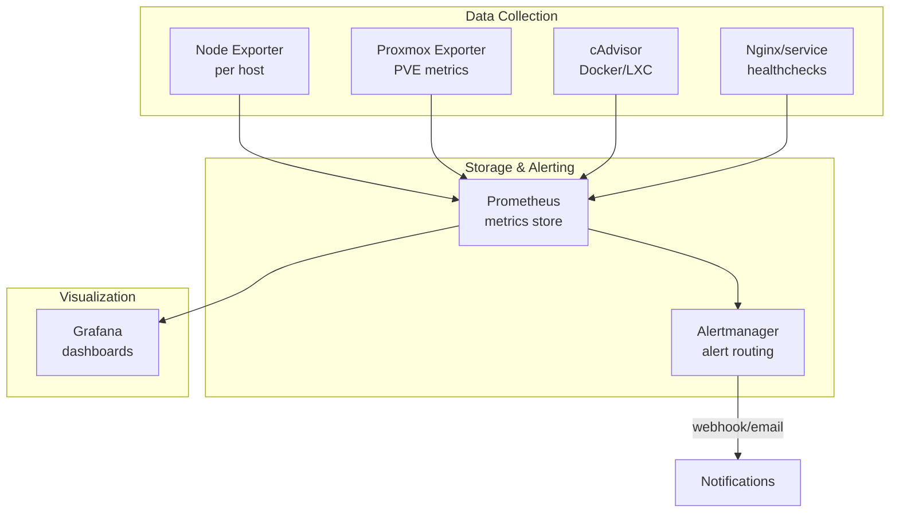

# Monitoring

## Current State

Monitoring is partially set up on the Proxmox node. Goal is to have full visibility across infrastructure, VMs, and network.

## Planned Stack



## Components

### Prometheus
Time-series metrics database. Scrapes exporters on a configured interval.

- Config: `/etc/prometheus/prometheus.yml`
- Retention: 15 days default (adjust based on disk space)
- Port: 9090

### Grafana
Visualization. Dashboards for:
- Proxmox node (CPU, RAM, disk, network)
- Per-VM/LXC resource usage
- Network bandwidth per VLAN (if router exports metrics)
- UPS status (CyberPower — use `nut` + exporter)

- Port: 3000
- Default dashboards: import from [grafana.com/dashboards](https://grafana.com/grafana/dashboards/)
  - Proxmox: dashboard ID `10347`
  - Node Exporter Full: dashboard ID `1860`

### Node Exporter
Install on every Linux host in the lab:

```bash
# Debian/Ubuntu
apt install prometheus-node-exporter
systemctl enable --now prometheus-node-exporter
# Exposes metrics at :9100
```

Hosts to instrument:
- Proxmox host (bare metal)
- Each VM/LXC
- Raspberry Pis
- HP laptop (if always-on)
- Acer Aspire (when in lab)

### Proxmox Exporter
Use `prometheus-pve-exporter` to get VM/LXC stats from the Proxmox API.

```bash
pip install prometheus-pve-exporter
# Configure with read-only PVE API token
```

### NUT (Network UPS Tools)
Monitor the CyberPower UPS over USB:

```bash
apt install nut
# Configure /etc/nut/ups.conf, /etc/nut/upsmon.conf
# Use nut-exporter to expose to Prometheus
```

## Alerting Ideas

| Alert | Condition | Severity |
|---|---|---|
| Host down | Node exporter unreachable >2m | Critical |
| High CPU | >90% for >10m | Warning |
| High RAM | >85% | Warning |
| Disk full | >80% on any mount | Warning |
| UPS on battery | UPS status = OB | Critical |
| UPS low battery | Battery charge <20% | Critical |
| VPN down | Mullvad interface unreachable | Warning |

## TODO

- [ ] Document what's currently running on Proxmox
- [ ] Set up Prometheus + Grafana (Docker Compose or LXC)
- [ ] Install node_exporter on all lab hosts
- [ ] Set up prometheus-pve-exporter
- [ ] Set up NUT + UPS exporter
- [ ] Build Grafana dashboards
- [ ] Configure Alertmanager (email or webhook to phone)
- [ ] Set up uptime monitoring for external services (e.g. Uptime Kuma)
