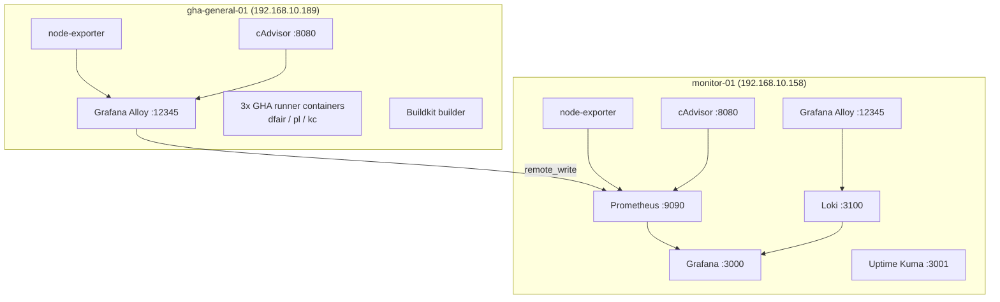

# Monitoring

## Current State

Fully deployed via Docker on two VMs — this is not aspirational, it's what's
actually running (confirmed via `docker ps -a` on both hosts). What's missing
is the **Grafana dashboard layer on top** — the previous dashboard was lost,
but the entire data-collection pipeline underneath it is healthy and intact.
Rebuild is tracked in issues
[#3](https://github.com/sethbarrett50/home_lab_docs/issues/3)–[#8](https://github.com/sethbarrett50/home_lab_docs/issues/8).

## Actual Stack

```mermaid
graph TD
    subgraph "gha-general-01 (192.168.10.189)"
        NE1[node-exporter]
        CB1[cAdvisor :8080]
        AL1[Grafana Alloy :12345]
        R1[3x GHA runner containers\ndfair / pl / kc]
        BK[Buildkit builder]
    end

    subgraph "monitor-01 (192.168.10.158)"
        NE2[node-exporter]
        CB2[cAdvisor :8080]
        AL2[Grafana Alloy :12345]
        PROM[Prometheus :9090]
        LOKI[Loki :3100]
        GF[Grafana :3000]
        KUMA[Uptime Kuma :3001]
    end

    NE1 --> AL1
    CB1 --> AL1
    AL1 -->|remote_write| PROM
    NE2 --> PROM
    CB2 --> PROM
    AL2 --> LOKI
    PROM --> GF
    LOKI --> GF
```

## Components (as deployed)

| Container | Host | Port | Role |
|---|---|---|---|
| `grafana` | monitor-01 | 3000 | Visualization — **dashboards lost, container itself healthy** |
| `prometheus` | monitor-01 | 9090 | Metrics store. **Not** 3001 — that's Kuma (see below, was documented wrong) |
| `uptime-kuma` | monitor-01 | 3001 | Uptime/status checks |
| `loki` | monitor-01 | 3100 | Log aggregation |
| `alloy` | monitor-01 + gha-general-01 | 12345 | Unified telemetry collector — ships node-exporter/cAdvisor data to Prometheus/Loki |
| `cadvisor` | monitor-01 + gha-general-01 | 8080 | Per-container CPU/mem/network metrics |
| `node-exporter` | monitor-01 + gha-general-01 | — | Host-level CPU/mem/disk metrics |
| `dfair-gha-runner-local`, `pl-gha-runner-local`, `kc-gha-runner-local` | gha-general-01 | — | The 3 self-hosted GitHub Actions runners |
| `buildx_buildkit_builder-*` | gha-general-01 | — | Buildkit builder for the runners |

**Fixed (was issue #3):** all scrape targets were still pointed at
pre-migration `192.168.1.x` IPs (proxmox's target was literally still
`192.168.1.197`, its old flat-network address) — a direct side effect of the
VLAN migration earlier this session. Fixed by updating
`/opt/monitoring/prometheus/prometheus.yml` on monitor-01 to the current
`192.168.10.x` addresses and restarting the `prometheus` container. All 6
configured targets (prometheus, monitor-01-node/-containers,
gha-general-01-node/-containers, proxmox-node) are now healthy.

**Not yet instrumented:** `nas` (LXC 105) has no node-exporter and isn't in
the scrape config at all — genuine gap, not a stale-IP issue. Needed before
the Infrastructure Overview dashboard (issue #5) can include it.

## Dashboard Rebuild Status

"Infrastructure Overview" dashboard rebuilt in Grafana (`192.168.10.158:3000`,
default `Prometheus` datasource — note there's also a stale, unused lowercase
`prometheus` datasource pointing at a dead IP, worth deleting eventually).
3-wide grid, 15 panels:

- **Row 1 (Infra):** up/down stat panels for proxmox/monitor-01/gha-general-01
  (`up{job="..."}`), plus CPU/Mem/Disk gauge panels per host (9 panels,
  instant queries against node-exporter metrics)
- **Row 2 (GHA Runners):** up/down stat panels for the 3 runner containers,
  using `count(container_last_seen{name="..."})` with value+special mappings
  (cAdvisor has no clean boolean like node-exporter's `up`, so "No Data" is
  the down signal here)

Closed: #3 (scrape targets), #4 (docs), #5 (Infra row), #6 (Runners up/down),
#9 (CPU/RAM/network panels per runner). 24 panels total now.

Dashboard is version-controlled as code:
[docs/services/dashboards/infra-overview.json](dashboards/infra-overview.json)
— the raw Grafana dashboard JSON (v13 Scenes-based schema), exported after
each round of changes so the dashboard's actual state lives in git, not just
in Grafana's own storage. To apply: Grafana → dashboard → **Edit** →
**Export/Share** → **Export as JSON** to see current state, or paste this
file's content into **Settings → JSON Model** to apply it.

Currently a flat 3-wide grid, not grouped into labeled row sections yet —
noted as a follow-up (owner wants proper collapsible row headers, deferred
until done via the Grafana UI directly rather than hand-authored, since the
v13 schema's `RowsLayout` kind isn't reliably documented and guessing it
risked breaking the import).

Open follow-ups: [#7](https://github.com/sethbarrett50/home_lab_docs/issues/7)
(GH Actions job-level metrics), [#8](https://github.com/sethbarrett50/home_lab_docs/issues/8)
(router traffic stats).

## Alerting Ideas (still aspirational — not built)

| Alert | Condition | Severity |
|---|---|---|
| Host down | Node exporter unreachable >2m | Critical |
| High CPU | >90% for >10m | Warning |
| High RAM | >85% | Warning |
| Disk full | >80% on any mount | Warning |
| GHA runner container down | cAdvisor shows container not running | Warning |

No Alertmanager or notification routing exists yet — Prometheus/Grafana are
collection + visualization only right now, nothing pages/notifies on
thresholds.
