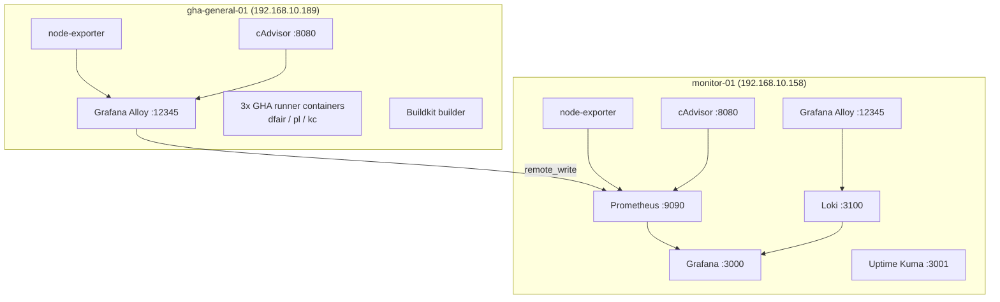

# Monitoring

## Current State

Fully deployed via Docker on two VMs — this is not aspirational, it's what's
actually running (confirmed via `docker ps -a` on both hosts). What's missing
is the **Grafana dashboard layer on top** — the previous dashboard was lost,
but the entire data-collection pipeline underneath it is healthy and intact.
Rebuild is tracked in issues
[#3](https://github.com/sethbarrett50/home_lab_docs/issues/3)–[#8](https://github.com/sethbarrett50/home_lab_docs/issues/8).

## Actual Stack

```mermaid
graph TD
    subgraph "gha-general-01 (192.168.10.189)"
        NE1[node-exporter]
        CB1[cAdvisor :8080]
        AL1[Grafana Alloy :12345]
        R1[3x GHA runner containers\ndfair / pl / kc]
        BK[Buildkit builder]
    end

    subgraph "monitor-01 (192.168.10.158)"
        NE2[node-exporter]
        CB2[cAdvisor :8080]
        AL2[Grafana Alloy :12345]
        PROM[Prometheus :9090]
        LOKI[Loki :3100]
        GF[Grafana :3000]
        KUMA[Uptime Kuma :3001]
    end

    NE1 --> AL1
    CB1 --> AL1
    AL1 -->|remote_write| PROM
    NE2 --> PROM
    CB2 --> PROM
    AL2 --> LOKI
    PROM --> GF
    LOKI --> GF
```

## Components (as deployed)

| Container | Host | Port | Role |
|---|---|---|---|
| `grafana` | monitor-01 | 3000 | Visualization — **dashboards lost, container itself healthy** |
| `prometheus` | monitor-01 | 9090 | Metrics store. **Not** 3001 — that's Kuma (see below, was documented wrong) |
| `uptime-kuma` | monitor-01 | 3001 | Uptime/status checks |
| `loki` | monitor-01 | 3100 | Log aggregation |
| `alloy` | monitor-01 + gha-general-01 | 12345 | Unified telemetry collector — ships node-exporter/cAdvisor data to Prometheus/Loki |
| `cadvisor` | monitor-01 + gha-general-01 | 8080 | Per-container CPU/mem/network metrics |
| `node-exporter` | monitor-01 + gha-general-01 | — | Host-level CPU/mem/disk metrics |
| `dfair-gha-runner-local`, `pl-gha-runner-local`, `kc-gha-runner-local` | gha-general-01 | — | The 3 self-hosted GitHub Actions runners |
| `buildx_buildkit_builder-*` | gha-general-01 | — | Buildkit builder for the runners |

**Not yet instrumented:** the Proxmox host itself and the `nas` LXC don't
appear to have node-exporter running — only the two VMs are confirmed
reporting. Needs verification before the Infrastructure Overview dashboard
(issue #5) can include them.

## Dashboard Rebuild Plan

See the linked issues for the full breakdown. Short version: verify scrape
targets are healthy (#3) → fix this doc + devices inventory (#4) → build
Infrastructure Overview row (#5) → build GHA Runners row (#6). GitHub
Actions job-level metrics (#7) and router-level traffic stats (#8) are
deferred, lower-priority follow-ups — genuinely separate scope, not part of
the initial rebuild.

## Alerting Ideas (still aspirational — not built)

| Alert | Condition | Severity |
|---|---|---|
| Host down | Node exporter unreachable >2m | Critical |
| High CPU | >90% for >10m | Warning |
| High RAM | >85% | Warning |
| Disk full | >80% on any mount | Warning |
| GHA runner container down | cAdvisor shows container not running | Warning |

No Alertmanager or notification routing exists yet — Prometheus/Grafana are
collection + visualization only right now, nothing pages/notifies on
thresholds.
