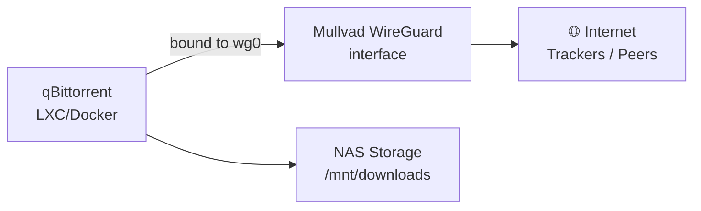

# NAS & Storage

## Status: Planned (HDDs pending)

Storage services will be set up once additional HDDs are purchased.

## Planned Stack

| Service | Role |
|---|---|
| NAS software (TBD) | File sharing, RAID management |
| qBittorrent | Torrent client with web UI |
| (Optional) Jellyfin/Plex | Media server |

### NAS Software Options

| Option | Type | Notes |
|---|---|---|
| **TrueNAS SCALE** | VM/bare-metal | ZFS native, feature-rich, heavier |
| **OpenMediaVault** | LXC/VM | Lighter, Debian-based, plugin ecosystem |
| **Cockpit + Samba** | LXC | Minimal, manual config, most flexible |
| **MergerFS + Snapraid** | LXC | Good for JBOD with parity, no RAID overhead |

> Recommendation: Start with **OpenMediaVault** in an LXC — easy web UI, good Proxmox integration, and can be replaced later. MergerFS+Snapraid is worth considering if you're doing JBOD with parity rather than strict RAID.

## qBittorrent

Run as a Docker container or LXC, ideally with traffic **bound to a Mullvad VPN interface** for privacy.

### qBittorrent VPN Binding

Bind qBittorrent's network interface to the Mullvad WireGuard interface so torrent traffic never leaks:

1. In qBittorrent Advanced settings, set **Network interface** to `wg0` (Mullvad interface)
2. If the interface goes down, qBittorrent stops transferring — built-in kill switch

Alternatively, use a Docker setup like `binhex/arch-qbittorrentvpn` which handles the VPN binding automatically.

## Storage Planning

### HDD Recommendations (when purchasing)
- Get at least **2 drives** of the same size for redundancy (RAID 1 or RAID Z1 in ZFS)
- NAS-rated drives (WD Red, Seagate IronWolf) are worth the premium for 24/7 operation
- Consider power draw — each spinning HDD adds ~5–8W to your budget

### Mount Points (Planned)
| Mount | Purpose |
|---|---|
| `/mnt/data` | General NAS shares |
| `/mnt/downloads` | qBittorrent downloads |
| `/mnt/backups` | Proxmox backups, device backups |

## TODO

- [ ] Purchase HDDs
- [ ] Decide on NAS software
- [ ] Set up NAS as VM or LXC on Proxmox
- [ ] Configure Samba/NFS shares
- [ ] Set up qBittorrent with Mullvad VPN binding
- [ ] Mount NAS storage in Proxmox as a datastore
- [ ] Set up automated backups for important data
