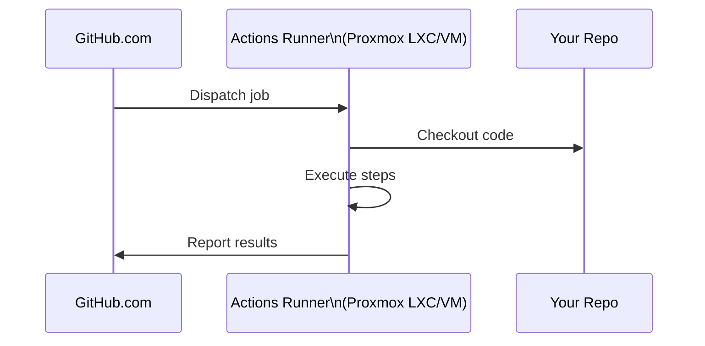

# Proxmox

## Host

**Dell Precision 3620** running Proxmox VE.

| Property | Value |
|---|---|
| IP | 192.168.10.10 (static) |
| Web UI | https://192.168.10.10:8006 |
| VLAN | 10 — Lab |

## Current Setup

- GitHub Actions self-hosted runner (active)
- Monitoring stack (partial — extend per [monitoring.md](monitoring.md))

## Planned VMs

### Debian VM
General-purpose Linux VM. Low priority — useful for isolated tasks or testing.

| Property | Value |
|---|---|
| OS | Debian 12 (Bookworm) |
| vCPU | 2 |
| RAM | 4GB |
| Disk | 32GB |
| Network | VLAN 10 |

### macOS VM
Running macOS on Proxmox requires some legwork (OpenCore). Useful for macOS-specific build tasks.

| Property | Value |
|---|---|
| OS | macOS (version TBD) |
| vCPU | 4+ |
| RAM | 8GB+ |
| Notes | Requires OpenCore bootloader, CPU passthrough |
| Reference | [OSX-KVM](https://github.com/kholia/OSX-KVM) |

### Windows VM
Windows for compatibility testing.

| Property | Value |
|---|---|
| OS | Windows 10/11 |
| vCPU | 4 |
| RAM | 8GB |
| Disk | 64GB |
| Notes | VirtIO drivers for performance |

### Firewall VM *(optional future)*
Running OPNsense or pfSense as a VM would allow more sophisticated firewall rules than the GL.iNet router alone. Would sit between router and VLAN interfaces.

## GitHub Actions Runner

Self-hosted runner for private repos and longer-running CI jobs.



### Runner Setup Notes
- Runner is registered at the org or repo level
- Labels: `self-hosted`, `linux`, `homelab`
- Keep runner process managed by systemd for auto-restart
- Consider running in a **LXC container** for isolation and easy snapshots

```bash
# Inside runner LXC/VM
./config.sh --url https://github.com/YOUR_ORG --token YOUR_TOKEN --labels homelab,linux
sudo ./svc.sh install
sudo ./svc.sh start
```

## Storage Layout (Planned)

| Datastore | Type | Use |
|---|---|---|
| `local` | LVM-thin | VM disks, ISOs |
| `local-zfs` | ZFS (if configured) | Snapshots, replication |
| `nas` | NFS/CIFS mount | Bulk storage from NAS service |

## TODO

- [ ] Document actual CPU/RAM specs of the 3620
- [ ] Configure VM templates (Debian, Windows)
- [ ] Research OpenCore macOS VM setup
- [ ] Configure Proxmox backup schedule (PBS or external)
- [ ] Add NAS storage as Proxmox datastore once HDDs arrive
- [ ] Set up Proxmox notifications (email or webhook)
