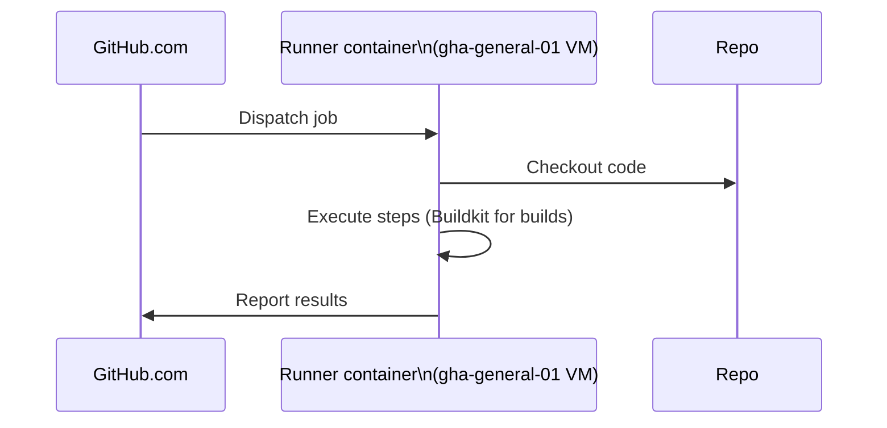

# Proxmox

## Host

**Dell Precision 3620** running Proxmox VE.

| Property | Value |
|---|---|
| IP | 192.168.10.10 (static) |
| Web UI | https://192.168.10.10:8006 |
| VLAN | 10 — Lab |
| Proxmox | VE 9.1.1 (kernel 6.17.2-1-pve) |
| BIOS | 2.8.1 |
| CPU | Intel Core i7-6700K (Skylake) — 4C/8T, 4.0–4.2 GHz |
| RAM | 32 GB — 4× 8 GB DDR4-2400 (all slots full), running at 2133 MT/s (the i7-6700K's rated max). ~18 GiB used at time of writing. 8 GiB swap |
| Boot/VM disk | Toshiba XG5 512 GB NVMe (`KXG50ZNV512G`) — holds `local` + `local-lvm` |
| HDDs | 2× 1 TB SATA 7200rpm — Seagate `ST1000DM003` (`sda`), Seagate `ST31000528AS` (`sdb`) |

Specs collected 2026-10-08 via `dmidecode`, `lscpu`, `lsblk`, `pveversion`.

## Current Setup

Actual running VMs/LXCs (see [devices/README.md](../devices/README.md) for
IPs/hostnames and [Service Status](README.md#service-status) for the full
services overview):

| VM/LXC | ID | Role |
|---|---|---|
| `gha-general-01` | VM 101 | 3x GitHub Actions runner containers (`dfair`/`pl`/`kc`), Buildkit, Grafana Alloy, cAdvisor, node-exporter |
| `monitor-01` | VM 102 | Grafana, Prometheus, Loki, Uptime Kuma, Alloy, cAdvisor, node-exporter — see [monitoring.md](monitoring.md) |
| `nas` | LXC 105 | File storage — software TBD, HDDs pending, see [nas.md](nas.md) |

### Future ideas (not started, no concrete plan)

Debian/macOS/Windows general-purpose VMs and an OPNsense/pfSense firewall
VM were floated before any of the above was actually deployed — none have
specs, a timeline, or active work behind them. Listed in
[Service Status](README.md#service-status) as low-priority "Planned" items;
revisit here with real specs only once one is actually prioritized.

## GitHub Actions Runners

Self-hosted, 3 runners (`dfair`/`pl`/`kc`) as Docker containers inside the
`gha-general-01` VM — not directly on the Proxmox host. Each dispatches CI
jobs from its respective repo:

```mermaid
sequenceDiagram
    participant GH as GitHub.com
    participant Runner as Runner container\n(gha-general-01 VM)
    participant Repo as Repo

    GH->>Runner: Dispatch job
    Runner->>Repo: Checkout code
    Runner->>Runner: Execute steps (Buildkit for builds)
    Runner->>GH: Report results
```

## Storage Layout

From `pvesm status` (2026-10-08):

| Storage | Type | Size | Used | Use |
|---|---|---|---|---|
| `local` | dir | ~94 GiB | ~5% | ISOs, templates, backups (on the NVMe root LV) |
| `local-lvm` | LVM-thin | ~349 GiB | ~25% | VM/LXC disks (NVMe) |
| `hdd-1tb` | dir | ~916 GiB | ~45% | Bulk storage on `sda1` (`/mnt/pve/hdd-1tb`, `is_mountpoint 1`) |
| `hdd-tmp-1tb` | dir | (root fs) | — | **Not actually on an HDD.** `sdb1` (ext4, label `hdd-tmp-1tb`) is formatted but not mounted, and this storage lacks `is_mountpoint 1`, so `/mnt/pve/hdd-tmp-1tb` is a plain directory on the NVMe root fs — anything written here eats the ~94 GiB root. Left as-is for now (deferred with the NAS work); avoid using this storage until it's fixed |

No NAS-backed (NFS/CIFS) storage yet — see [nas.md](nas.md).

## TODO

- [x] Document actual CPU/RAM specs of the 3620
- [ ] Configure Proxmox backup schedule (PBS or external)
- [ ] Add NAS storage as Proxmox datastore once HDDs arrive
- [ ] Attach `sdb1` at `/mnt/pve/hdd-tmp-1tb` (fstab by UUID, `nofail`) and set `is_mountpoint 1`, or remove the storage — deferred with the NAS work
- [ ] Set up Proxmox notifications (email or webhook)
