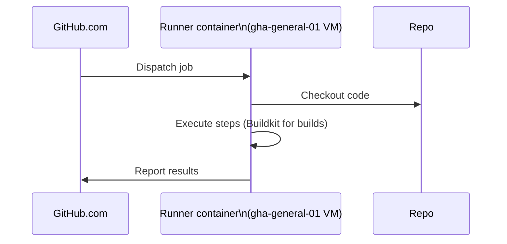

# Proxmox

## Host

**Dell Precision 3620** running Proxmox VE.

| Property | Value |
|---|---|
| IP | 192.168.10.10 (static) |
| Web UI | https://192.168.10.10:8006 |
| VLAN | 10 — Lab |

## Current Setup

Actual running VMs/LXCs (see [devices/README.md](../devices/README.md) for
IPs/hostnames and [Service Status](README.md#service-status) for the full
services overview):

| VM/LXC | ID | Role |
|---|---|---|
| `gha-general-01` | VM 101 | 3x GitHub Actions runner containers (`dfair`/`pl`/`kc`), Buildkit, Grafana Alloy, cAdvisor, node-exporter |
| `monitor-01` | VM 102 | Grafana, Prometheus, Loki, Uptime Kuma, Alloy, cAdvisor, node-exporter — see [monitoring.md](monitoring.md) |
| `nas` | LXC 105 | File storage — software TBD, HDDs pending, see [nas.md](nas.md) |

### Future ideas (not started, no concrete plan)

Debian/macOS/Windows general-purpose VMs and an OPNsense/pfSense firewall
VM were floated before any of the above was actually deployed — none have
specs, a timeline, or active work behind them. Listed in
[Service Status](README.md#service-status) as low-priority "Planned" items;
revisit here with real specs only once one is actually prioritized.

## GitHub Actions Runners

Self-hosted, 3 runners (`dfair`/`pl`/`kc`) as Docker containers inside the
`gha-general-01` VM — not directly on the Proxmox host. Each dispatches CI
jobs from its respective repo:

```mermaid
sequenceDiagram
    participant GH as GitHub.com
    participant Runner as Runner container\n(gha-general-01 VM)
    participant Repo as Repo

    GH->>Runner: Dispatch job
    Runner->>Repo: Checkout code
    Runner->>Runner: Execute steps (Buildkit for builds)
    Runner->>GH: Report results
```

## Storage Layout (Planned)

| Datastore | Type | Use |
|---|---|---|
| `local` | LVM-thin | VM disks, ISOs |
| `local-zfs` | ZFS (if configured) | Snapshots, replication |
| `nas` | NFS/CIFS mount | Bulk storage from NAS service |

## TODO

- [ ] Document actual CPU/RAM specs of the 3620
- [ ] Configure Proxmox backup schedule (PBS or external)
- [ ] Add NAS storage as Proxmox datastore once HDDs arrive
- [ ] Set up Proxmox notifications (email or webhook)
