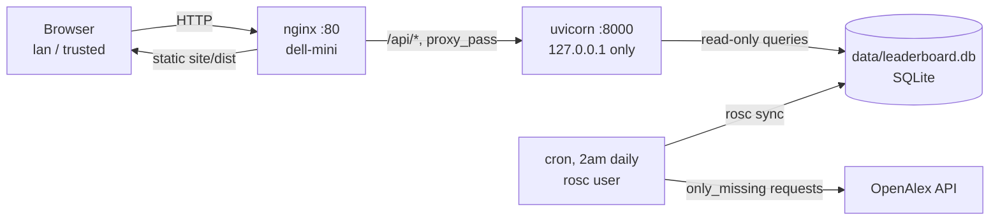

# research-output-scraper

## Status: Done — running in production

A leaderboard of US-based CS researchers ranked by publication count,
sourced from the [OpenAlex](https://openalex.org/) API. Pilot scope covers
five institutions (University of Georgia, Georgia Tech, MIT, Carnegie
Mellon, Augusta University). Private repo:
[sethbarrett50/research-output-scraper](https://github.com/sethbarrett50/research-output-scraper).

Unlike everything else in [Services](README.md), this doesn't run on the
Proxmox node — it's deployed directly on `dell-mini` (see
[devices/README.md](../devices/README.md)), per that repo's own
`docs/deploy.md`.

## Architecture



- **nginx** serves the built static site (`site/dist/`, a Vite multi-page
  build) directly and reverse-proxies `/api/` to uvicorn. It's the only
  thing actually reachable from outside `dell-mini` — uvicorn binds
  `127.0.0.1` only, which is also what makes the API's `X-Real-IP`-based
  rate limiter trustworthy.
- **systemd** (`research-output-scraper-api.service`) runs the FastAPI
  backend. No container — single-process deploy to a single box, per that
  repo's `docs/deploy.md` "Why this shape" section.
- **cron**, under a dedicated unprivileged `rosc` system user, runs
  `rosc sync` nightly at 2am. This only refreshes students already in the
  database (`only_missing`-scoped, so it doesn't re-burn OpenAlex budget);
  newly discovered candidate authors stay `pending` until a human runs
  `rosc review` by hand — unattended cron can't do that step.

## Network

| Property | Value |
|---|---|
| Host | `dell-mini` (192.168.10.117), VLAN 10 (Lab) |
| Public port | 80 (HTTP only, no TLS — LAN-only, no domain yet) |
| Reachable from | `lan`, `trusted` (see [devices/README.md § Cross-VLAN Firewall Rules](../devices/README.md#cross-vlan-firewall-rules-lab-access-from-mgmttrusted)) |
| API internal port | 8000, `127.0.0.1` only — never exposed |

The `lan`/`trusted` → `dell-mini:80` firewall rules didn't exist when this
was first deployed — the site 404'd from outside `dell-mini` until that gap
was found and two `uci` rules were added on the Flint 2 (`lan`→`lab` and
`trusted`→`lab`, both dest `192.168.10.117:80`). See the firewall rule
table linked above for the current full set.

## Known deploy gotchas

Two bugs were found deploying this the first time, both now fixed upstream
in the repo's own `docs/deploy.md` and `deploy/nginx/*.conf` (not
re-documented in full here — see that repo for specifics):

- nginx's `try_files` never fell back to `index.html` for the root path
  itself (named sub-pages like `/contact` worked fine, masking it).
- `rosc`'s home directory (`/opt/research-output-scraper`, since it
  doubles as the deploy path) defaults to `700` from `useradd
  --create-home`, which blocks nginx's `www-data` worker from traversing
  into it — every request 404'd with a permission-denied `stat()` that's
  indistinguishable from a missing file without checking
  `/var/log/nginx/error.log`.

Also worth knowing: `rosc`'s deploy key (used to clone/pull the private
repo) is **read-only by design** — pushing from `dell-mini` will always
fail with "key marked as read only". That's intentional, not a bug: a
production box should never be able to write back to the repo. One
consequence — don't hand-edit anything inside the git checkout itself
(e.g. `deploy/nginx/research-output-scraper.conf`'s `server_name`); edit
the *installed* copy in `/etc/nginx/sites-available/` instead, or a local
commit piles up that can never be pushed and every future `git pull`
degrades into a manual merge.

## Monitoring

Beyond host-level metrics (node-exporter, see below), three Uptime Kuma
monitors cover this service specifically — a plain "is the device up" check
isn't enough here, since nginx can be healthy while uvicorn or the nightly
sync are silently broken behind it:

| Monitor | Type | Target | Catches |
|---|---|---|---|
| Site | HTTP(s), expect `200` | `http://192.168.10.117/` | nginx itself down |
| API | JSON Query: `$count($) > 0` == `true` | `http://192.168.10.117/api/universities` | uvicorn dead, or serving a broken/empty DB, behind a healthy nginx |
| Sync cron | Push, 1500min (25h) heartbeat | n/a (cron pushes to Kuma) | the nightly `rosc sync` silently failing or not running at all |

Site and API run on Kuma's defaults (60s interval, 0 retries, 60s retry
interval), so a single failed check alerts — bump retries to 1-2 if
transient blips get noisy. A Kuma notification channel is configured for all
three monitors. Telegram was tried and doesn't work from this network — see
[Upstream DNS](../networking/README.md#upstream-dns).

The cron job's crontab entry (`sudo -u rosc crontab -e` on dell-mini) reports
its own success/failure to the Push monitor's URL via `&&`/`||`:

```text
... rosc sync >> data/rosc-sync.log 2>&1 && curl .../push/<token>?status=up&msg=OK&ping= > /dev/null || curl .../push/<token>?status=down&msg=sync+failed&ping= > /dev/null
```

Host-level CPU/Mem/Disk: `dell-mini` has a native node-exporter (no Docker,
so no cAdvisor), scraped directly by Prometheus and on the Grafana
Infrastructure Overview dashboard — see [Monitoring](monitoring.md).

## TODO

- [ ] TLS once a real domain is chosen (`certbot --nginx` is the documented
      path in that repo's `docs/deploy.md`)
